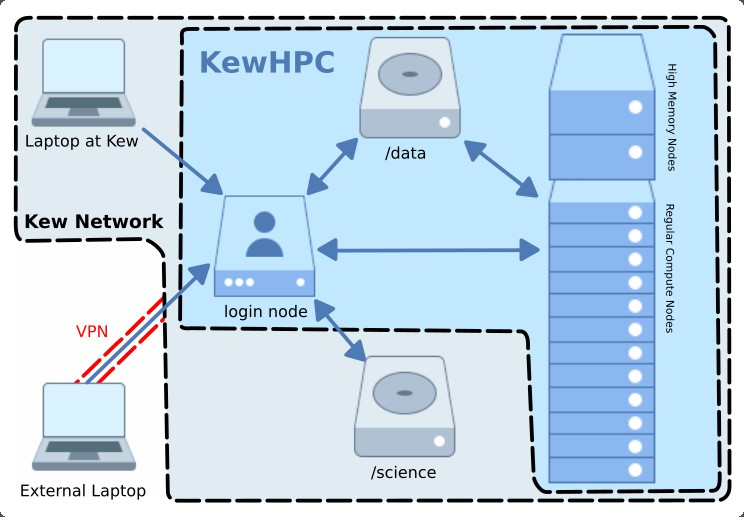

# KewHPC
## Overview

KewHPC is our onsite compute cluster for use by Kew Sceince staff, students and collaborators. It has a command line linux interface [bash](commandline.md), job scheduler [slurm](./software/slurm.md) and has a variety of bioinformatic analysis packages installed. To get access, or for general queries/software requests, please contact [Matt Clarke](mailto:m.clarke@kew.org).

## Technical Specifications
KewHPC runs on CentOS 7.7 with a total of 576 cores and 7.6TB RAM across 14 nodes

12x Compute nodes with:

* 2 x18 core Intel Xeon CPU @ 2.6GHz
* 384 GB RAM

2 x High Memory nodes with:

* 4 x 18  core Intel Xeon CPU @ 2.6GHz
* 1.5 TB RAM

