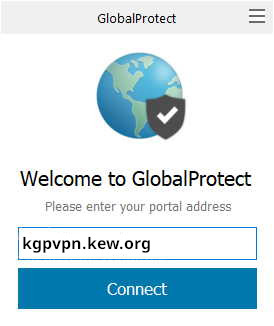
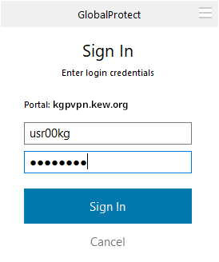

# Remote Access

To access KewHPC remotely you'll need to connect to one of two VPN services. They both use the Global Protect client and use your Kew username and password.

## For Kew Staff on Kew machines

This is the standard Kew VPN, it will also give access to shared drives and other services located at Kew.

* [kgpvpn.kew.org](https://kgpvpn.kew.org)

For access contact [IT services](mailto:support@kew.org)

## For Anyone on non-Kew machines

This VPN only grants access to KewHPC. If you have access to KewHPC at Kew you have access to this VPN too.

* [dmzgate.dmz.kew.org](https://dmzgate.dmz.kew.org)

For access contact [Matt Clarke](mailto:m.clarke@kew.org)

## Global Protect VPN client
Using any web browser go to [kgpvpn.kew.org](https://kgpvpn.kew.org) or [dmzgate.dmz.kew.org](https://dmzgate.dmz.kew.org) and log in with your kew username and password.

Once logged in click the link for your Operating System, Download and Install the Global Protect Client. Then enter the Portal name `kgpvpn.kew.org` or `dmzgate.dmz.kew.org`

The enter your Kew username and password and "Sign In".

There is also a VPN to the Wakehurst Site, to use it replace `kgpvpn.kew.org` with `wgpvpn.kew.org`

## Setting up collaborators to work on KewHPC

If a collaborator requires access to KewHPC to run analysis an account can be created for the DMZ VPN by sending the following information to support@kew.org and m.clarke@kew.org .

* Name and email of collaborator
* Name and email of sponsor (a permanent Kew staff Member, ideally a line manager)
* Account expiry date (default 6 months from account creation)
* Authorisation from Paul Kersey

The account will expire automatically or if the sponsor leaves Kew. The account can be extended by the sponsor, with authorisation from Paul Kersey.
