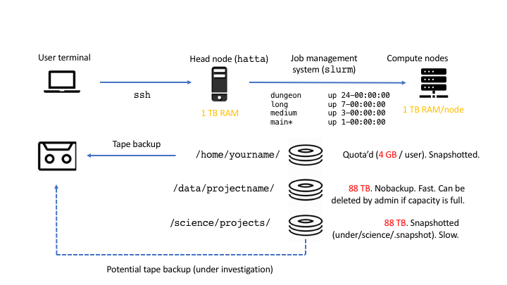

# About HATTA

HATTA is a small (192 core) compute cluster, which can be used by anyone at Kew. It has a variety of bioinformatics and spatial analysis packages installed. To get access, or for general queries/software requests, please contact [Matt Clarke](mailto:m.clarke@kew.org).

## System Overview

## Connecting

Once you've been given access by IT you'll nee to SSH in to the head node (hatta)

### Windows

Using [PuTTY](https://putty.org), enter hatta into the hostname box

Enter "yes" or "y" if asked to confirm adding hatta to hosts list.

log in using your username and password

###Linux/MacOS
open a terminal window and type

	ssh username@hatta

Type "yes" if prompted to confirm adding hatta to your hosts list

enter your password.

## Transfering files 

There are a couple of ways to transfer files to/from the cluster 

###Windows
using a scp/ftp/sftp client such as [FileZilla](https://filezilla-project.org/download.php?platform=win64) or [WinSCP](https://winscp.net/eng/index.php)

as with PuTTY the host is hatta and you use your kew username and password

###Linux/Mac

[FileZilla](https://filezilla-project.org) also works on both Linux and Mac as GUI Method.

For larger files or many files you can use rsync via the terminal
Copying to hatta:

	rsync -zvP /local/file/or/directory username@hatta://directory/to/copy/to

Copying from hatta:

	rsync -zvP username@hatta://file/or/directory/to/copy /local/destination/for/files

If you want to copy a directories contents and not the directory itself add a trailing "/" to the first argument.
If the rsync command is interupted just  re-run the exact command and its should continue from the file it was last transfering.

## Queueing system

The load management system for HATTA is SLURM. Basic usage and some helpful hints can be found on the [slurm](https://rbg-kew-bioinformatics-utils.readthedocs.io/en/latest/cluster/slurm/) page.

## Tech specs
Runs Ubuntu 18.04 LTS

Total 192 cores and 3.0 TB RAM a cross 3 nodes
Compute nodes 1 & 2, each with:

* 4 x 22 core Intel Xeon CPU @ 2.20-3.00GHz
* 1.0 TB RAM

Compute node 3 with:

* 2 x 8 core Intel Xeon CPU @ 3.20-3.60GHz
* 1.0 TB RAM

## Rules
* Be considerate - the cluster is a shared resource. Please don't interfere with other people's jobs or data. Compute power is limited, please don't fill the entire cluster with your jobs
* Follow sensible security practices - don't share accounts, don't leave connections open to the cluster on shared computers, make sure you know that the data source you're using is safe.
* Report issues/ broken things
* Do not store data on the cluster. Please move it off when you are done. The cluster is not backed up, and your data may just vanish if too many discs fail.
