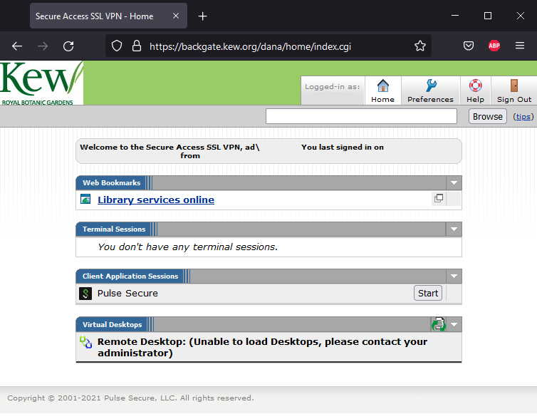
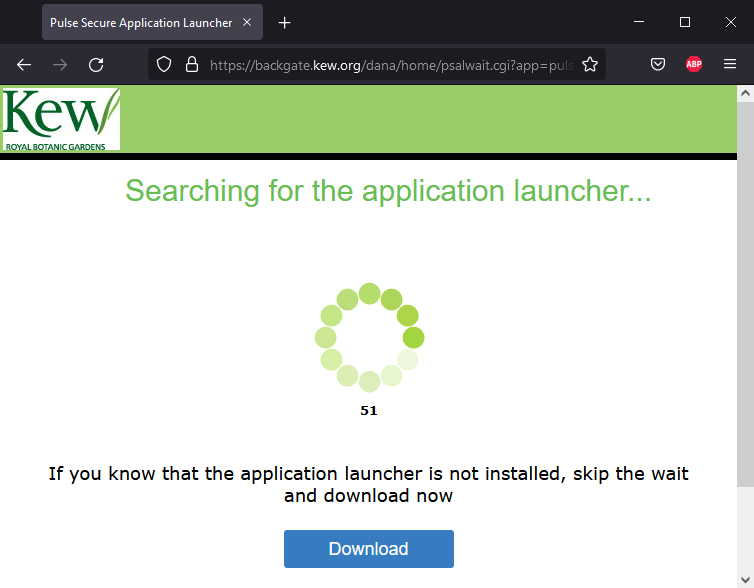
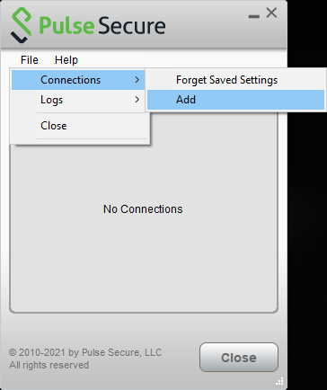
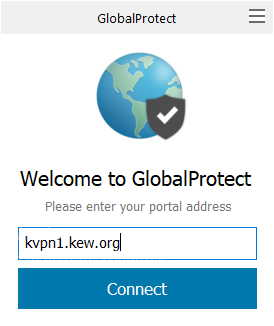
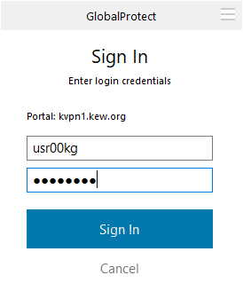
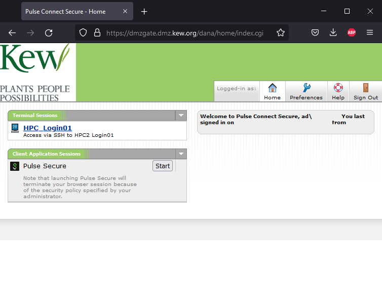
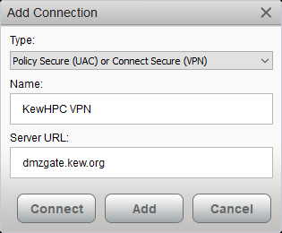

# Remote Access

To use Kew's computational resources remotely you'll need to connect to one of the below VPN services.

## KewVPN 

Kew Provides 2 VPN services for Kew staff to connect to Kew services remotely from their Kew issued laptop.

For access to either you'll need to contact [IT services](mailto:support@kew.org)

### PulseSecure

Using any web browser go to [backgate.kew.org](https://backgate.kew.org) and log in with your kew username and password, with the realm as "AD".

Once logged in Click the "start" button.

Then hit the download button, save and install the Pulse Secure client.

Once Pulsesecure is installed open pulse secure if its not already then add a new connection ("+" or File > Connections > Add)

In the new window name your connection and set the server URL to backgate.kew.org and click "Connect".

Select the Realm "AD" and enter your user name and password when prompted

*There are limited simultaneous licences for the Pulse Secure VPN so if you get an error saying it's at capacity try one of the other methods. For the same reason you should log out as soon as you're done to allow others to login.*

### GlobalProtect

Using any web browser go to [kvpn1.kew.org](https://kvpn1.kew.org) and log in with your kew username and password.

Once logged in click the link for your Operating System, Download and Install the Global Protect Client. Then enter the Portal name kvpn1.kew.org

The enter your Kew username and password and "Sign In".

## KewHPC DMZ VPN

This is a VPN service specifically for connecting to KewHPC for both Kew staff and external collaborators. It uses Pulse Secure so if you already have the Pulse Secure Client installed skip to the last step.

Using any web browser go to [dmzgate.kew.org](https://dmzgate.kew.org) and log in with your kew username prefixed with "AD\" (e.g. AD\usr00kg ) and password.

Once logged in Click the "start" button.

Then hit the download button, save and install the Pulse Secure client.

Once Pulsesecure is installed open pulse secure if its not already then add a new connection ("+" or File > Connections > Add)

In the new window name your connection and set the server URL to dmzgate.kew.org and click "Connect".

Select the Realm "AD" and enter your user name and password when prompted

*There are limited simultaneous licences for the Pulse Secure VPN so if you get an error saying it's at capacity try one of the other methods. For the same reason you should log out as soon as you're done to allow others to login.*

## Setting up collaborators to work on KewHPC

If a collaborator requires access to KewHPC to run analysis an account can be created for the DMZ VPN by sending the following information to support@kew.org and m.clarke@kew.org .

* Name and email of collaborator
* Name and email of sponsor (a permanent Kew staff Member, ideally a line manager)
* Account expiry date (default 6 months from account creation)
* Authorisation from Paul Kersey

The account will expire automatically or if the sponsor leaves Kew. The account can be extended by the sponsor, with Authorisation from Paul Kersey.