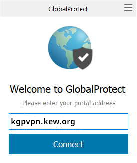
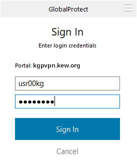

# Remote Access

To access hpcstorage remotely you'll need to connect via Kew's VPN. To connect from MacOS or Windows you'll need the Global Connect VPN client

## For Kew Staff on Kew machines

This is the standard Kew VPN, it will also give access to shared drives and other services located at Kew.

* [kgpvpn.kew.org](https://kgpvpn.kew.org)

For access and support contact [IT services](mailto:support@kew.org)

## Global Protect VPN client
Using any web browser go to [kgpvpn.kew.org](https://kgpvpn.kew.org) and log in with your kew username and password.

Once logged in click the link for your Operating System, Download and Install the Global Protect Client. Then enter the Portal name `kgpvpn.kew.org` or `dmzgate.dmz.kew.org`

The enter your Kew username and password and "Sign In".

There is also a VPN to the Wakehurst Site, to use it replace `kgpvpn.kew.org` with `wgpvpn.kew.org`

